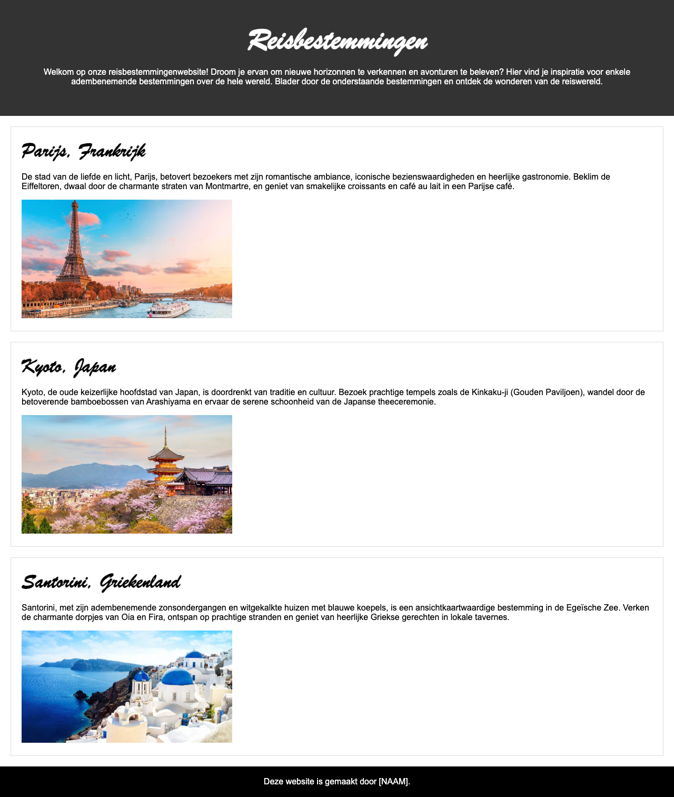
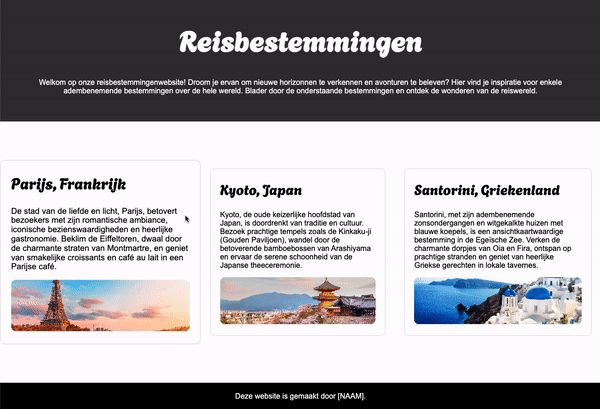
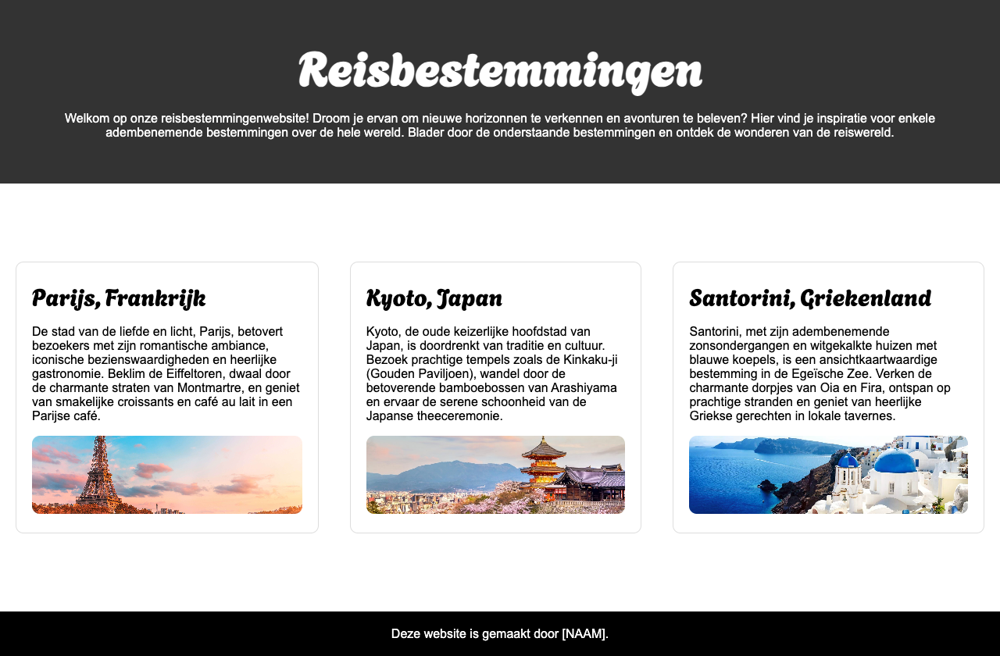

# Proefstuderen CMGT

**Inhoudsopgave**

- [Proefstuderen CMGT](#proefstuderen-cmgt)
- [Opdracht 1: Teksten in HTML](#opdracht-1-teksten-in-html)
- [Opdracht 2: Teksten vormgeven met CSS](#opdracht-2-teksten-vormgeven-met-css)
- [Opdracht 3: Afbeeldingen](#opdracht-3-afbeeldingen)
- [Opdracht 4: Basisstructuur HTML](#opdracht-4-basisstructuur-html)
- [Opdracht 5a (regulier): Basisstructuur vormgeven](#opdracht-5a-regulier-basisstructuur-vormgeven)
- [Opdracht 5b (advanced): Basisstructuur vormgeven](#opdracht-5b-advanced-basisstructuur-vormgeven)

<br>

# Opdracht 1: Teksten in HTML
Zet onderstaande teksten om naar HTML in Codepen. Je hebt hiervoor de volgende HTML-tags nodig:

- `<h1>`
- `<h2>`
- `<p>`

<br>

> Reisbestemmingen<br>
> Welkom op onze reisbestemmingenwebsite! Droom je ervan om nieuwe horizonnen te verkennen en avonturen te beleven? Hier vind je inspiratie voor enkele adembenemende bestemmingen over de hele wereld. Blader door onderstaande bestemmingen en ontdek de wonderen van de reiswereld.

<br>

> Parijs, Frankrijk<br>
> De stad van de liefde en licht, Parijs, betovert bezoekers met zijn romantische ambiance, iconische bezienswaardigheden en heerlijke gastronomie. Beklim de Eiffeltoren, dwaal door de charmante straten van Montmartre, en geniet van smakelijke croissants en café au lait in een Parijse café.

<br>

> Kyoto, Japan<br>
> Kyoto, de oude keizerlijke hoofdstad van Japan, is doordrenkt van traditie en cultuur. Bezoek prachtige tempels zoals de Kinkaku-ji (Gouden Paviljoen), wandel door de betoverende bamboebossen van Arashiyama en ervaar de serene schoonheid van de Japanse theeceremonie.

<br>

> Santorini, Griekenland<br>
> Santorini, met zijn adembenemende zonsondergangen en witgekalkte huizen met blauwe koepels, is een ansichtkaartwaardige bestemming in de Egeïsche Zee. Verken de charmante dorpjes van Oia en Fira, ontspan op prachtige stranden en geniet van heerlijke Griekse gerechten in lokale tavernes.

<br><br>

# Opdracht 2: Teksten vormgeven met CSS

Nu de teksten netjes in HTML-tags staan wordt het tijd om deze vorm te geven met de CSS. Voer met behulp van de cheatsheet onderstaande opdrachten uit:

1. Stel de `<h1>` en `<h2>` in op een ander lettertype naar wens
2. Verwerk minimaal 3 kleuren naar wens
3. Maak de inleidende tekst groter (hiervoor moet je een `class` instellen op die `<p>`)

<br><br>

# Opdracht 3: Afbeeldingen

Plaats onderstaande afbeeldingen onder de bijbehorende tekst door gebruik te maken van de HTML-tag ``. Voer de volgende stappen uit:

1. Kopieer het adres van onderstaande afbeelding (klik met de rechter muistoets op de afbeelding en vervolgens op `Adres van afbeelding kopiëren`.)
2. Schrijf je HTML-tag en voer de URL in: ``
3. Stel in de CSS in dat alle afbeeldingen `400px` breed moeten zijn


<br>

| Parijs                                                               | Kyoto                                                               | Santorini                                                                      |
| -------------------------------------------------------------------- | ------------------------------------------------------------------- | ------------------------------------------------------------------------------ |
|  |  |  |


<br><br>

# Opdracht 4: Basisstructuur HTML

Onderstaande HTML is de basisstructuur die je nodig hebt voor deze opdracht. Kopieer onderstaande HTML naar Codepen en verplaats alle content die je tot nu toe hebt gemaakt naar de juiste tags van de basisstructuur. De website ziet er na deze opdracht op het eerste gezicht nog hetzelfde uit, maar bij de volgende opdracht ga je deze basisstructuur gebruiken om jouw pagina veel meer als een echte website te laten aanvoelen.

```html
<header>
    <!-- VERVANG DIT VOOR DE INLEIDENDE TEKSTEN -->
</header>

<main>

	<section>
        <!-- VERVANG DIT VOOR DE TEKSTEN OVER PARIJS -->
    </section>

	<section>
        <!-- VERVANG DIT VOOR DE TEKSTEN OVER KYOTO -->
    </section>

	<section>
        <!-- VERVANG DIT VOOR DE TEKSTEN OVER SANTORINI -->
    </section>

</main>

<footer>
    <!-- VERVANG DIT MET DE VOLGENDE TEKST: Deze website is gemaakt door [VOER JOUW NAAM IN]. -->
</footer>
```

<br><br>

# Opdracht 5a (regulier): Basisstructuur vormgeven
Nu de pagina qua HTML helemaal klaar is, wordt het tijd om het als een echte website te laten aanvoelen. Nu zie je alleen nog teksten en afbeeldingen onder elkaar staan, maar een website heeft ook altijd een bepaalde vlakverdeling. In de HTML heb je hier al de basis voor gelegd, doordat je de basisstructuur hebt doorgevoerd. Nu kan je die HTML-elementen vormgeven in de CSS. Bouw onderstaand ontwerp na en hou rekening met het volgende:

| Onderwerp            | Toelichting                                                                         |
| -------------------- | ----------------------------------------------------------------------------------- |
| Gebruikte kleurcodes | #333333 - #FFFFFF - #DDDDDD                                                         |
| Lettertypes          | Gebruik de lettertypes die je bij opdracht 2 hebt gekozen.                          |
| Padding              | Gebruik `padding` om ruimte **binnen** een element te maken (bv. `padding: 20px;`). |
| Margin               | Gebruik `margin` om ruimte **om** een element te maken  (bv. `margin: 20px;`).      |

<br>

**Het ontwerp**
<br>*Klik op het ontwerp om te vergroten*



<br><br>

# Opdracht 5b (advanced): Basisstructuur vormgeven
Heb jij al eerder gewerkt met HTML en CSS? Daag jezelf dan uit door deze advanced opdracht uit te voeren. Bouw onderstaand ontwerp na en hou rekening met het volgende:

| Onderwerp              | Toelichting                                                                                                                                                                                                                      |
| ---------------------- | -------------------------------------------------------------------------------------------------------------------------------------------------------------------------------------------------------------------------------- |
| Gebruikte kleurcodes   | #333333 - #FFFFFF - #DDDDDD                                                                                                                                                                                                      |
| Lettertypes            | Stel de `<h1>` en `<h2>` met een zelfgekozen lettertype van Google Fonts.                                                                                                                                                        |
| Flexbox                | Met Flexbox is het o.a. mogelijk om elementen naast elkaar te positioneren.                                                                                                                                                      |
| object-fit             | Gebruik `object-fit` om de afbeeldingen correct weer te geven.                                                                                                                                                                   |
| border-radius          | Gebruik `border-radius` om hoeken af te ronden.                                                                                                                                                                                  |
| transition & transform | Gebruik `transition` in combinatie met `transform` om iedere `<section>` te vergroten wanneer je de muis erop plaatst: <br> |

<br>

**Het ontwerp**
<br>*Klik op het ontwerp om te vergroten*

